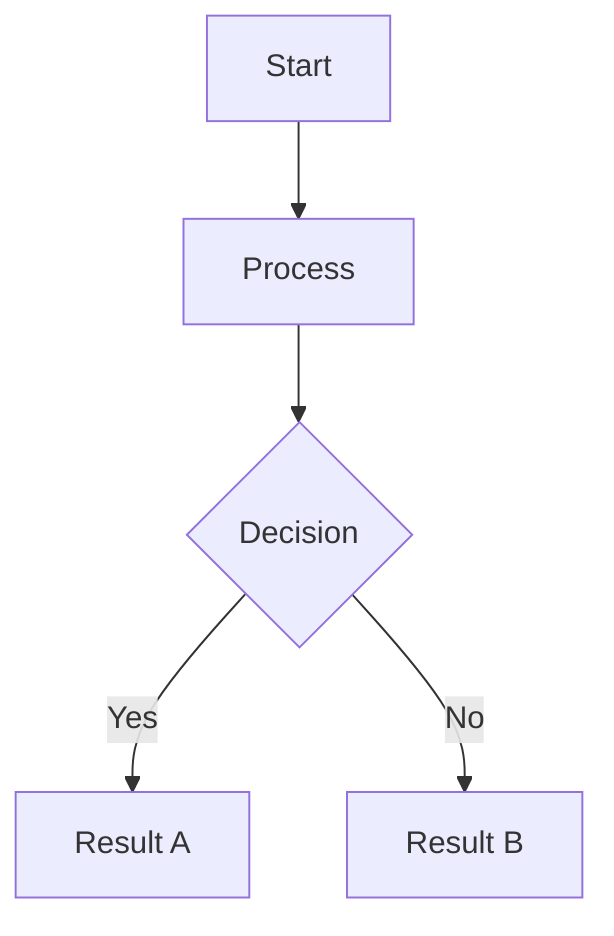

# gospelo-md2pdf

Convert Markdown to PDF with Japanese support and MermaidJS diagrams.

## Features

- **Japanese Text Support**: Full support for Japanese fonts (Noto Sans CJK JP, Hiragino Sans, Yu Gothic)
- **MermaidJS Diagrams**: Automatically renders Mermaid diagrams as PNG images
- **Custom CSS**: Use your own stylesheets or the built-in professional style
- **Markdown Extensions**: Tables, fenced code blocks, TOC, metadata, and more
- **Special HTML Classes**: Summary boxes, warnings, pros/cons sections, page breaks

## Installation

```bash
pip install gospelo-md2pdf
```

### System Dependencies

WeasyPrint requires system libraries. Install them first:

**macOS:**
```bash
brew install pango glib gdk-pixbuf libffi
```

**Ubuntu/Debian:**
```bash
sudo apt install libpango-1.0-0 libpangocairo-1.0-0 libgdk-pixbuf2.0-0
```

### Japanese Fonts (Recommended)

For Japanese text rendering:

**macOS:**
```bash
brew install font-noto-sans-cjk-jp
```

**Ubuntu/Debian:**
```bash
sudo apt install fonts-noto-cjk
```

### MermaidJS Support (Optional)

To render Mermaid diagrams:

```bash
npm install -g @mermaid-js/mermaid-cli
```

## Quick Start

```bash
# Basic usage
gospelo-md2pdf report.md

# Specify output file
gospelo-md2pdf report.md output.pdf

# Specify output directory
gospelo-md2pdf report.md -o ./pdf

# Use custom CSS
gospelo-md2pdf report.md --css custom-style.css

# Delete intermediate HTML file
gospelo-md2pdf report.md --no-html
```

## Usage

```
gospelo-md2pdf <input.md> [output.pdf] [options]

Arguments:
  input.md              Input Markdown file
  output.pdf            Output PDF file (optional)

Options:
  -o, --output-dir DIR  Output directory (default: current directory)
  -c, --css FILE        Custom CSS file
  --no-html             Delete intermediate HTML file
  --lang LANG           HTML lang attribute (default: ja)
  -q, --quiet           Suppress output messages
  --verbose             Print verbose output
  -v, --version         Show version
  -h, --help            Show help
```

### Environment Variables

| Variable | Description | Default |
|----------|-------------|---------|
| `MD2PDF_OUTPUT_DIR` | Output directory | Current directory |

Note: `--output-dir` option takes precedence over the environment variable.

## Markdown Features

### Basic Syntax

```markdown
# Heading 1
## Heading 2
### Heading 3

Paragraph with **bold** and *italic* text.

- Bullet list
- Another item
  - Nested item

1. Numbered list
2. Another item

> Blockquote

`inline code`

[Link](https://example.com)
```

### Tables

```markdown
| Column 1 | Column 2 | Column 3 |
|----------|----------|----------|
| A        | B        | C        |
| D        | E        | F        |
```

### Code Blocks

````markdown
```python
def hello():
    print("Hello, World!")
```
````

### MermaidJS Diagrams

````markdown

````

Supported diagram types:
- Flowcharts (`graph TD`, `graph LR`)
- Sequence diagrams (`sequenceDiagram`)
- Class diagrams (`classDiagram`)
- State diagrams (`stateDiagram-v2`)
- ER diagrams (`erDiagram`)
- And all other Mermaid diagram types

## Special HTML Classes

Use these HTML classes in your Markdown for special styling:

### Summary Box (Green)

```html
<div class="summary">
Important summary points here.
</div>
```

### Warning Box (Orange)

```html
<div class="warning">
Warning message here.
</div>
```

### Info Box (Blue)

```html
<div class="info">
Additional information here.
</div>
```

### Pros/Cons

```html
<div class="pros">
Pros: High scalability
</div>

<div class="cons">
Cons: Initial cost
</div>
```

### Disclaimer

```html
<div class="disclaimer">
This report is for informational purposes only.
</div>
```

### Page Break

```html
<div class="page-break"></div>
```

## Python API

```python
from gospelo_md2pdf import convert_md_to_pdf

# Basic usage
convert_md_to_pdf("report.md")

# With options
convert_md_to_pdf(
    input_file="report.md",
    output_file="output.pdf",
    output_dir="./pdf",
    css_file="custom.css",
    keep_html=True,
    lang="ja",
    verbose=True
)
```

## Troubleshooting

### Japanese text not rendering

Check if Japanese fonts are installed:

```bash
fc-list :lang=ja | head -5
```

### WeasyPrint library errors on macOS

Set the library path:

```bash
export DYLD_LIBRARY_PATH=/opt/homebrew/lib:$DYLD_LIBRARY_PATH
```

Add to `~/.zshrc` for persistence:

```bash
echo 'export DYLD_LIBRARY_PATH=/opt/homebrew/lib:$DYLD_LIBRARY_PATH' >> ~/.zshrc
source ~/.zshrc
```

### Mermaid diagrams not rendering

Verify mermaid-cli is installed:

```bash
mmdc --version
```

If not installed:

```bash
npm install -g @mermaid-js/mermaid-cli
```

## Requirements

- Python >= 3.10
- weasyprint >= 60.0
- markdown >= 3.5.0
- System: pango, glib, gdk-pixbuf (see Installation)
- Optional: @mermaid-js/mermaid-cli (for Mermaid diagrams)

## License

MIT License - see [LICENSE](LICENSE) for details.

## Author

NoStudio LLC (goro-hayakawa@no-studio.net)

## Links

- [GitHub Repository](https://github.com/gorosun/gospelo-md2pdf)
- [Issue Tracker](https://github.com/gorosun/gospelo-md2pdf/issues)
- [PyPI Package](https://pypi.org/project/gospelo-md2pdf/)
