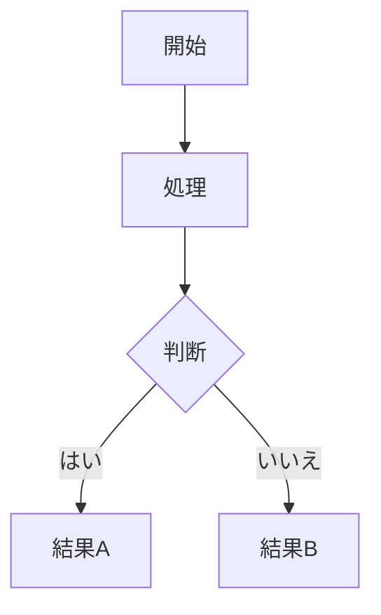

# gospelo-md2pdf

日本語対応・MermaidJSダイアグラム対応のMarkdown→PDF変換ツール

## 特徴

- **日本語対応**: Noto Sans CJK JP、ヒラギノ角ゴシック、游ゴシックなどの日本語フォントに対応
- **MermaidJSダイアグラム**: Mermaidダイアグラムを自動的にPNG画像として埋め込み
- **カスタムCSS**: 独自のスタイルシートまたは内蔵のプロフェッショナルスタイルを使用可能
- **Markdown拡張**: テーブル、コードブロック、目次、メタデータなどに対応
- **特殊HTMLクラス**: サマリーボックス、警告、メリット/デメリット、改ページなど

## インストール

```bash
pip install gospelo-md2pdf
```

### システム依存ライブラリ

WeasyPrintにはシステムライブラリが必要です。先にインストールしてください：

**macOS:**
```bash
brew install pango glib gdk-pixbuf libffi
```

**Ubuntu/Debian:**
```bash
sudo apt install libpango-1.0-0 libpangocairo-1.0-0 libgdk-pixbuf2.0-0
```

### 日本語フォント（推奨）

日本語テキストのレンダリングに必要：

**macOS:**
```bash
brew install font-noto-sans-cjk-jp
```

**Ubuntu/Debian:**
```bash
sudo apt install fonts-noto-cjk
```

### MermaidJSサポート（オプション）

Mermaidダイアグラムをレンダリングするには：

```bash
npm install -g @mermaid-js/mermaid-cli
```

## クイックスタート

```bash
# 基本的な使用法
gospelo-md2pdf report.md

# 出力ファイルを指定
gospelo-md2pdf report.md output.pdf

# 出力ディレクトリを指定
gospelo-md2pdf report.md -o ./pdf

# カスタムCSSを使用
gospelo-md2pdf report.md --css custom-style.css

# 中間HTMLファイルを削除
gospelo-md2pdf report.md --no-html
```

## 使用方法

```
gospelo-md2pdf <input.md> [output.pdf] [オプション]

引数:
  input.md              入力Markdownファイル
  output.pdf            出力PDFファイル（オプション）

オプション:
  -o, --output-dir DIR  出力ディレクトリ（デフォルト: カレントディレクトリ）
  -c, --css FILE        カスタムCSSファイル
  --no-html             中間HTMLファイルを削除
  --lang LANG           HTML lang属性（デフォルト: ja）
  -q, --quiet           出力メッセージを抑制
  --verbose             詳細出力
  -v, --version         バージョン表示
  -h, --help            ヘルプ表示
```

### 環境変数

| 変数 | 説明 | デフォルト |
|------|------|-----------|
| `MD2PDF_OUTPUT_DIR` | 出力ディレクトリ | カレントディレクトリ |

注: `--output-dir`オプションは環境変数より優先されます。

## Markdown機能

### 基本記法

```markdown
# 見出し1
## 見出し2
### 見出し3

**太字**と*斜体*を含む段落。

- 箇条書き
- 別の項目
  - ネストした項目

1. 番号付きリスト
2. 別の項目

> 引用

`インラインコード`

[リンク](https://example.com)
```

### テーブル

```markdown
| 列1 | 列2 | 列3 |
|-----|-----|-----|
| A   | B   | C   |
| D   | E   | F   |
```

### コードブロック

````markdown
```python
def hello():
    print("Hello, World!")
```
````

### MermaidJSダイアグラム

````markdown

````

対応ダイアグラム:
- フローチャート (`graph TD`, `graph LR`)
- シーケンス図 (`sequenceDiagram`)
- クラス図 (`classDiagram`)
- 状態遷移図 (`stateDiagram-v2`)
- ER図 (`erDiagram`)
- その他すべてのMermaidダイアグラム

## 特殊HTMLクラス

### サマリーボックス（緑）

```html
<div class="summary">
重要なポイントをここに記載。
</div>
```

### 警告ボックス（オレンジ）

```html
<div class="warning">
警告メッセージをここに記載。
</div>
```

### 情報ボックス（青）

```html
<div class="info">
補足情報をここに記載。
</div>
```

### メリット/デメリット

```html
<div class="pros">
メリット: スケーラビリティが高い
</div>

<div class="cons">
デメリット: 初期コストがかかる
</div>
```

### 免責事項

```html
<div class="disclaimer">
本レポートは情報提供を目的としています。
</div>
```

### 改ページ

```html
<div class="page-break"></div>
```

## Python API

```python
from gospelo_md2pdf import convert_md_to_pdf

# 基本的な使用法
convert_md_to_pdf("report.md")

# オプション付き
convert_md_to_pdf(
    input_file="report.md",
    output_file="output.pdf",
    output_dir="./pdf",
    css_file="custom.css",
    keep_html=True,
    lang="ja",
    verbose=True
)
```

## トラブルシューティング

### 日本語が表示されない

日本語フォントがインストールされているか確認：

```bash
fc-list :lang=ja | head -5
```

### macOSでWeasyPrintのライブラリエラー

ライブラリパスを設定：

```bash
export DYLD_LIBRARY_PATH=/opt/homebrew/lib:$DYLD_LIBRARY_PATH
```

永続化するには`~/.zshrc`に追加：

```bash
echo 'export DYLD_LIBRARY_PATH=/opt/homebrew/lib:$DYLD_LIBRARY_PATH' >> ~/.zshrc
source ~/.zshrc
```

### Mermaidダイアグラムがレンダリングされない

mermaid-cliがインストールされているか確認：

```bash
mmdc --version
```

インストールされていない場合：

```bash
npm install -g @mermaid-js/mermaid-cli
```

## 必要要件

- Python >= 3.10
- weasyprint >= 60.0
- markdown >= 3.5.0
- システム: pango, glib, gdk-pixbuf（インストールセクション参照）
- オプション: @mermaid-js/mermaid-cli（Mermaidダイアグラム用）

## ライセンス

MIT License - 詳細は[LICENSE](../LICENSE)を参照

## 作者

NoStudio LLC (goro-hayakawa@no-studio.net)

## リンク

- [GitHubリポジトリ](https://github.com/gorosun/gospelo-md2pdf)
- [Issue Tracker](https://github.com/gorosun/gospelo-md2pdf/issues)
- [PyPIパッケージ](https://pypi.org/project/gospelo-md2pdf/)
