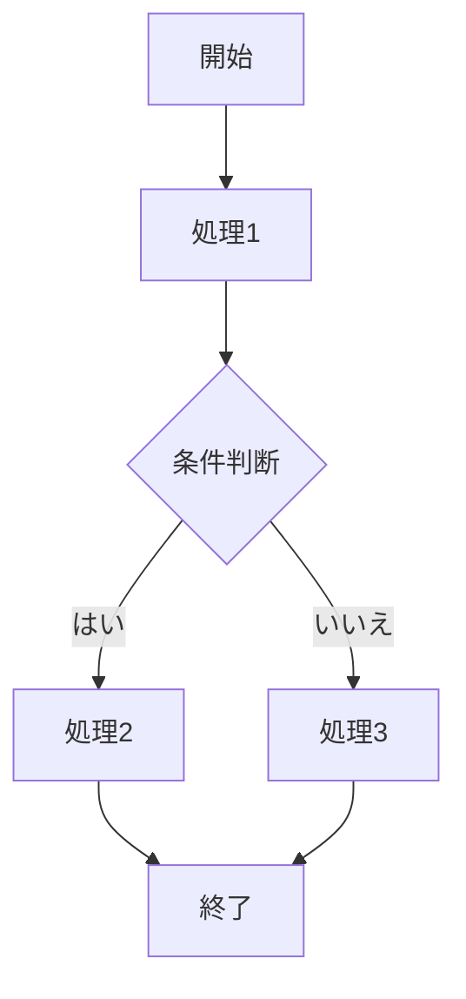
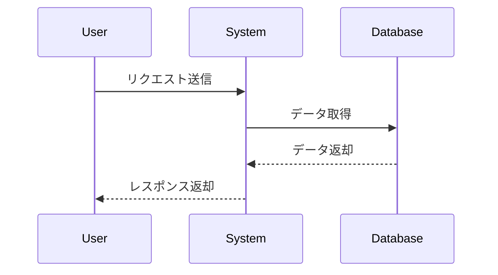
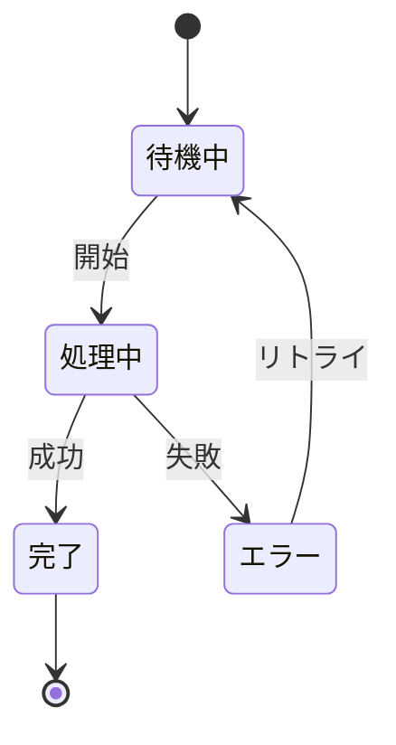

# Mermaidダイアグラムサンプル

このドキュメントにはMermaidダイアグラムが含まれています。

## フローチャート

```mermaid
graph TD
    A[開始] --> B[処理1]
    B --> C{条件判断}
    C -->|はい| D[処理2]
    C -->|いいえ| E[処理3]
    D --> F[終了]
    E --> F
```

## シーケンス図

```mermaid
sequenceDiagram
    participant User
    participant System
    participant Database

    User->>System: リクエスト送信
    System->>Database: データ取得
    Database-->>System: データ返却
    System-->>User: レスポンス返却
```

## 状態遷移図

```mermaid
stateDiagram-v2
    [*] --> 待機中
    待機中 --> 処理中: 開始
    処理中 --> 完了: 成功
    処理中 --> エラー: 失敗
    完了 --> [*]
    エラー --> 待機中: リトライ
```
